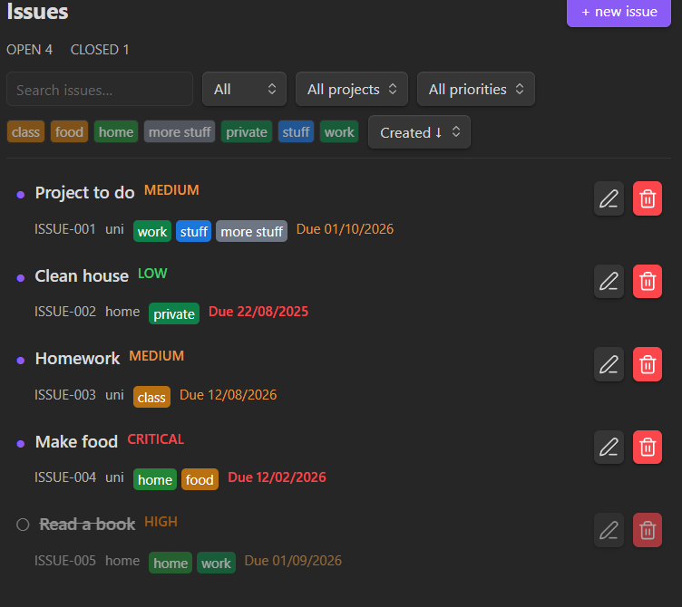
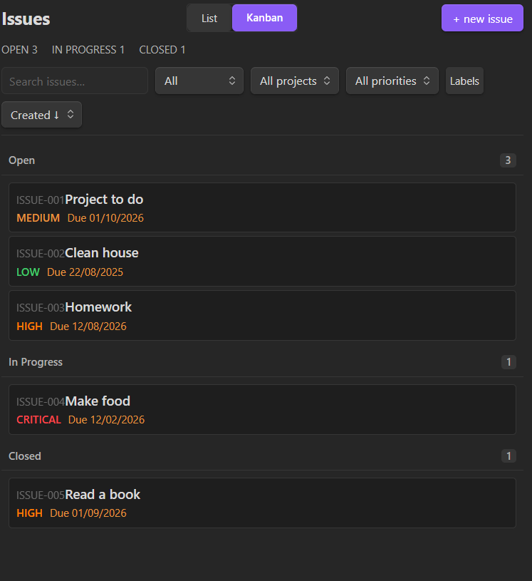
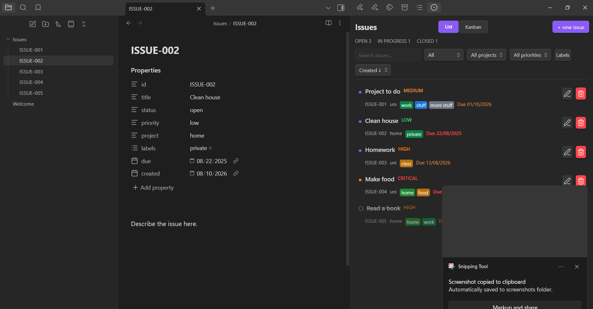
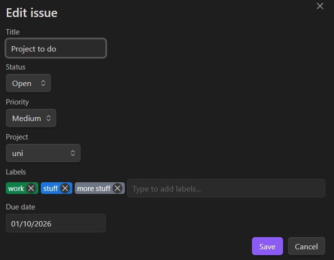
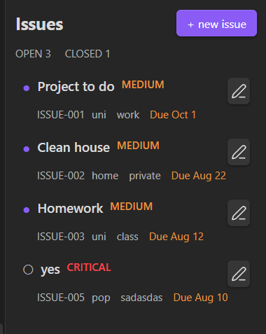
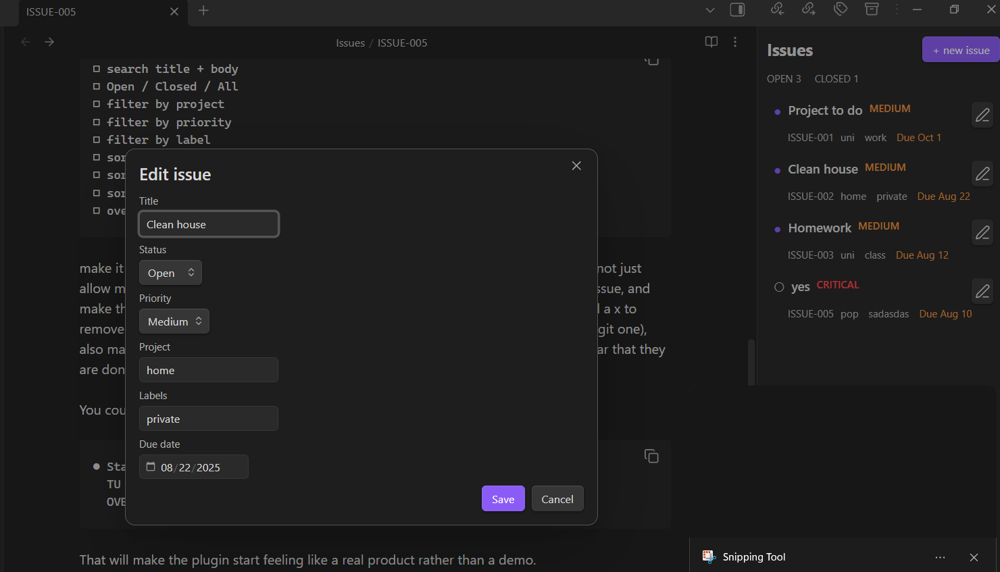

# Obsidian Issues

A GitHub Issues-inspired issue tracker for Obsidian. Issues are stored as normal Markdown files, so your data remains readable and useful even without the plugin.

## Why

This plugin exists because Obsidian has no built-in task tracker with the workflow affordances of GitHub Issues — status cycling, labels, priorities, due dates, drag-and-drop Kanban, and bidirectional linking to your notes. It was built as a hackable, self-contained alternative to external tools so the workflow stays inside your vault. The codebase is intentionally kept dependency-free and easy to modify: issue data is plain YAML frontmatter in Markdown files, so you can fix, extend, or inspect issues with nothing more than a text editor.

It also serves as a vehicle for working through a larger TypeScript/Obsidian plugin project end-to-end — from initial scaffolding to filtering, search, Kanban, and a settings UI.

## Project structure

```
src/
  main.ts            Plugin entry point, lifecycle, commands, vault event wiring
  issue-service.ts   Reads, writes, caches, and migrates issue files
  issues-view.ts     The sidebar view: list and Kanban rendering
  issue-modal.ts     New/edit issue form with tag-input labels
  tag-input.ts       Reusable tag-input component for labels
  labels.ts          Label colour assignment
  dates.ts           Date parsing, formatting, and comparison helpers
  constants.ts       Status/priority enums, field order, folder/prefix defaults
  types.ts           Issue, IssueData, IssueStatus, IssuePriority types
  settings.ts        Settings tab (re-exports config from config/settings.ts)
  confirm-modal.ts   Reusable confirmation dialog
config/
  settings.ts        Settings interface, defaults, normalisation, view-host contract
filters/
  issue-filter.ts    Search + multi-select filtering (status, project, priority, labels)
  issue-sort.ts      Sort logic by created date, due date, or priority
utils/
  issue-id.ts        Prefix normalisation, filename pattern matching, next-ID computation
```

`styles.css` is loaded by Obsidian alongside `main.js` and `manifest.json`. Source in `src/` is bundled with esbuild into `main.js` at the plugin root.

## Milestone: v0.1 — starter

This first milestone supports:

- `Open issues` command
- right-sidebar Issues view
- `+ New Issue` button
- automatic `Issues/` folder creation
- sequential files such as `ISSUE-001.md`, `ISSUE-002.md`, ...
- reading issue `title` and `status` from YAML frontmatter
- opening an issue note by clicking it in the sidebar
- live sidebar refresh when issue files change

Example issue:

```md
---
id: ISSUE-001
title: New issue
status: open
created: 2026-08-10
---

Describe the issue here.
```

## Milestone: v0.2 — issue metadata + editing

Adds richer issue metadata and in-place editing:

- **Close/reopen toggle** — click the status dot (●/○) to toggle open and closed
- **New issue modal** — `+ new issue` opens a form with title (status not editable)
- **Priority field** — `low` / `medium` / `high` / `critical` dropdown with color-coded badges
- **Project field** — free-text project name
- **Labels field** — comma-separated tags displayed as pills in the sidebar
- **Due date** — date picker shown in the row metadata
- **Edit issue modal** — pencil icon per row opens the same form with all fields editable (including status)

Updated issue format with all v0.2 fields:

```md
---
id: ISSUE-005
title: Implement API client
status: open
priority: high
project: Auth Service
labels:
  - backend
  - security
due: 2026-08-20
created: 2026-08-10
---

Describe the issue here.
```

Old v0.1 issues display and edit without errors — missing fields fall back to their defaults.

## Milestone: v0.3 — search, filters & sorting

Adds tools for managing larger collections of issues through search, filtering and sorting.

- **Issue search** — live text search across titles and labels
- **Open / Closed / All filters** — toggle the visible issue set
- **Project filtering** — project dropdown selection
- **Priority filtering** — filter by one or more priority levels
- **Label filtering** — filter by selected labels
- **Due-date filtering** — filter by overdue, due this week, etc.
- **Sort by** — priority, creation date, and due date (ascending or descending)
- **Overdue indicators** — issues past their due date are flagged
- **Open and closed issue counters** — live counts in the sidebar header
- **Delete issue button** — remove an issue from the edit modal
- **GitHub-style label tags** — color-coded label pills with a configurable palette

Date format updated to day/month/year (e.g. `10/08/2026`).



## Milestone: v0.4.0 — Kanban

Introduces a visual Kanban board alongside the existing list view.

- **List / Kanban view switching**
- **Open, In Progress and Closed columns**
- **Drag-and-drop issue cards**
- **Moving a card automatically updates Markdown frontmatter**
- **Status synchronization between Kanban and list views**
- **Basic dashboard statistics**
- **Improved search filtering**




## Milestone: v0.5.0 — Kanban and knowledge-base integration

Adds deep integration with the user's Obsidian knowledge base, allowing tasks and project work to
reference the notes they originated from.

Features:

- **List / Kanban view switching**
- **Single-column Kanban with status group separation**
- **Drag-and-drop issue cards**
- **Moving a card automatically updates Markdown frontmatter**
- **Status synchronization between Kanban and list views**
- **Basic dashboard statistics**
- **Create issue from the currently open note**
- **Link issues to source notes**
- **Navigate from an issue to its related note**
- **Project relationships**
- **Commands for creating and managing issues from anywhere in Obsidian**
- **Improved integration with Obsidian's workspace**

Commands added to the Command Palette:

| Command | What it does |
| --- | --- |
| `Open issues` | Reveals the issues view in the right sidebar |
| `Create issue` | Opens the new-issue form from anywhere |
| `Create issue for current note` | Creates an issue linked to the active note |
| `Toggle list / Kanban layout` | Switches the issues view between layouts |

An issue created from a note records the note in its `source` field, and the note records the
issue in its own `issues` list — so the link is navigable in both directions:

```md
---
id: ISSUE-007
title: Rewrite the onboarding section #1
status: in-progress
priority: high
project: Handbook
source: Notes/Handbook.md
labels:
  - docs
due: 20/08/2026
created: 2026-08-13
---
```


### Reliability and interface work in this release

- Frontmatter is now written through Obsidian's own `processFrontMatter` API. The previous
  serializer quoted values without escaping them, so an issue whose title contained a `"` produced
  invalid YAML and silently lost its metadata. Existing issues are read and repaired automatically.
- Writes no longer rewrite the whole file, so they can't overwrite unsaved changes in an open editor.
- Deleting an issue asks for confirmation (can be turned off in settings).
- Due dates use a native date picker and are validated; unreadable values are flagged in the list
  instead of rendering as `Invalid date`.
- Due dates are colour-coded by urgency: **red** once overdue, **amber** on the day they are due,
  muted otherwise. Closing an issue retires the colour — a closed issue is never shown as overdue,
  since its deadline is history.
- Unrecognised `status` values fall back to `open` rather than making the issue vanish from the board.
- The status dot cycles open → in progress → closed instead of discarding the in-progress state.
- Search covers titles, bodies, labels, projects and issue IDs, and is debounced.
- Undated issues sort last regardless of sort direction.
- Vault changes no longer rebuild the toolbar, so the search box keeps focus while you type.
- Full keyboard support: filter options, status toggles and Kanban cards are all reachable, and
  `Ctrl`/`Cmd` + `←`/`→` cycles a focused issue's status (open → in progress → closed).
- All colours now come from Obsidian theme variables, so the plugin follows light and dark themes.
- New settings tab: default layout, default sort order, and delete confirmation.

## Milestone: v0.6.0 — configurability & migration

This release makes Vault Issues configurable for different vault structures and prepares the plugin
for public distribution.

Added:

- **Configurable issues folder** — set any folder name in settings; the plugin creates it and stores
  issues there. The default remains `" Issues"` (with a leading space so it sorts to the top of the
  file list). Dot-prefixed names are rejected because Obsidian's Vault API silently ignores them.
- **Configurable issue ID prefix** — choose a filename prefix such as `ISSUE`, `TASK`, or `BUG`.
  The input is normalised to uppercase alphanumeric + underscores (`task` → `TASK`, `issue-name` →
  `ISSUE_NAME`), and issue files are named `<PREFIX>-001.md`, `<PREFIX>-002.md`, …
- **Default priority setting** — pick the priority (`low` / `medium` / `high` / `critical`)
  pre-filled when creating a new issue.
- **Persistent default layout and sorting** — the default view (list or Kanban) and default sort
  order now live in settings and survive restarts, instead of being reset each session.
- **Improved migration of issues created by earlier versions** — existing issues are migrated
  automatically from legacy folder locations (`.Issues`, `Issues`, and the v0.5 default `" Issues"`)
  into the configured issues folder on first load. Duplicates at the destination are skipped and
  the source file removed, leaving no orphans.


## Milestone: v0.7.0 — reliability & architecture

This release focuses on the internal architecture and reliability of Vault Issues as the project moves
toward a stable release. No major workflow changes are introduced; the focus is making the existing
functionality safer, easier to test, and easier to extend.

Added:

- **Expanded automated test suite** — 109 unit tests using Node's built-in test runner, covering issue
  IDs, statuses, sorting, filtering, settings normalisation, and frontmatter parsing.
- **Automated tests in GitHub Actions** — the CI pipeline now runs `npm test` on Node.js 20, 22, and 24,
  catching regressions before release.

Improved:

- **Refactored the Issues view into smaller, focused modules** — the monolithic `issues-view.ts` is
  split into dedicated modules for filtering (`filters/issue-filter.ts`), sorting
  (`filters/issue-sort.ts`), ID utilities (`utils/issue-id.ts`), and settings configuration
  (`config/settings.ts`).
- **Improved separation between UI, filtering, persistence, and issue-management logic** — pure logic
  is extracted from Obsidian-dependent code, making it independently testable.
- **Improved handling of malformed or incomplete Markdown issue files** — invalid frontmatter values
  fall back to safe defaults rather than breaking the view; impossible dates and unknown statuses are
  handled gracefully.
- **Improved maintainability of the TypeScript codebase** — strict typing, sentence-case conventions,
  and consistent module boundaries support future extension.

## Development setup

Use a separate development vault. A convenient layout is:

```text
ObsidianDev/
└── .obsidian/
    └── plugins/
        └── obsidian-issues/
```

Clone this repository into the plugin folder, then run:

```bash
npm install
npm run dev
```

In Obsidian:

1. Open the `ObsidianDev` vault.
2. Go to **Settings → Community plugins**.
3. Turn off Restricted mode if necessary.
4. Enable **Vault Issues**.
5. Open the Command Palette and run **Open issues**.
6. Click **+ New issue**.

You should now have:

```text
ObsidianDev/
├──  Issues/
│   └── ISSUE-001.md
└── .obsidian/
    └── plugins/
        └── obsidian-issues/
```

The issues folder is named `" Issues"` with a leading space so it sorts to the top of the file
list. Vaults created with v0.1–v0.3 used `Issues/` or `.Issues/`; both are migrated automatically
on first load.

## Tests

```bash
npm test
```

Runs the unit-test suite with Node's built-in test runner (requires Node 22+).

Coverage added in v0.7:

- **Settings** (`tests/settings.test.ts`) — `normalizeSettings()` coercion: dot-prefixed folders,
  whitespace, invalid priorities / view modes / sort keys, and prefix uppercasing.
- **Issue IDs** (`tests/issue-id.test.ts`) — filename pattern matching, prefix normalisation,
  `shortIssueId`, and next-ID computation with configurable prefixes.
- **Filtering** (`tests/filtering.test.ts`) — search across titles/bodies/labels/projects/IDs,
  multi-select status / project / priority / label filters, and `hasActiveFilters`.
- **Sorting** (`tests/sorting.test.ts`) — created / due / priority ordering, undated-last
  behaviour, tie-breaking by numeric ID, and malformed-date handling.
- **Status & frontmatter** (`tests/status.test.ts`, `tests/frontmatter.test.ts`) — status cycling,
  fallback defaults for unknown values, and date validation including impossible dates like
  `31/02/2026`.

## Production build

```bash
npm run build
```

The build produces `main.js` in the repository root. Obsidian loads the plugin from `main.js`,
`manifest.json`, and `styles.css`.

**Editing the source is not enough — Obsidian only ever runs `main.js`.** After changing anything in
`src/` or `styles.css`, rebuild and then reload the plugin (disable and re-enable it under
**Settings → Community plugins**, or run **Reload app without saving**). `npm run dev` watches and
rebuilds automatically, but the reload is still needed for Obsidian to pick up the new file.

If esbuild refuses to run — for example its installed binary doesn't match the current platform,
which happens when `node_modules` was installed on a different OS — there is a fallback bundler
that uses `tsc` instead:

```bash
npm run build:fallback
```

It produces a larger, unminified `main.js` with identical behaviour. `npm run build` remains the
supported path.

## Screenshots

### v0.7.0


### v0.5.0


### v0.4.0


### v0.3




### v0.2




### v0.1


## Roadmap

- **v0.1** ~ completed — create/read/close issues
- **v0.2** ~completed — labels, priority, projects, due dates, edit modal
- **v0.3** ~completed — filters, search
- **v0.4** ~completed — Kanban/dashboard
- **v0.5** ~completed — Kanban and knowledge-base integration
- **v0.5** ~completed — note integration, commands, settings, accessibility and reliability pass
- **v0.6** ~completed — configurable issues folder, ID prefix, and default priority; migration
- **v0.7** ~completed — reliability & architecture: expanded tests, CI test step, module refactor
- **v1.0** — polished release, expanded test coverage, documentation, demo GIF, GitHub release
