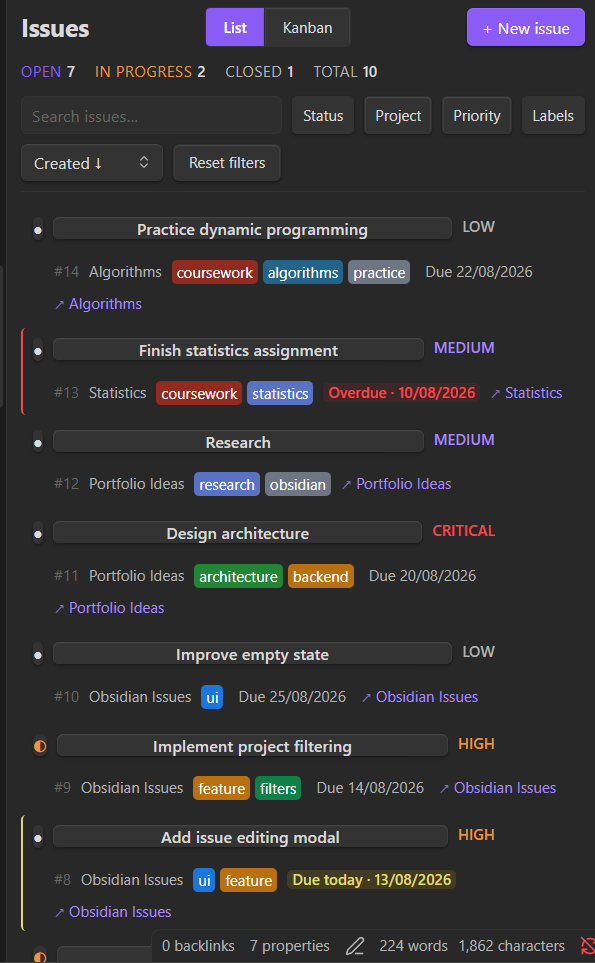
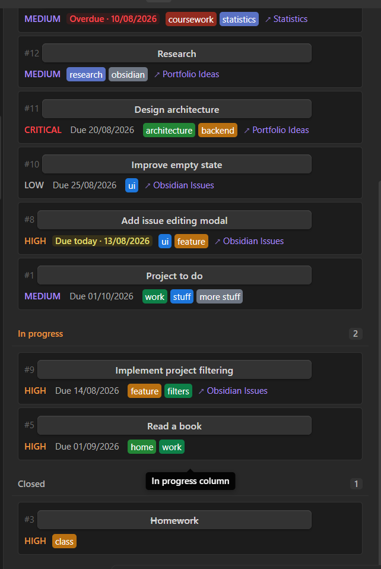
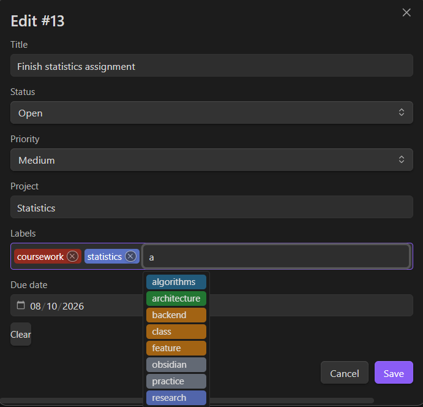
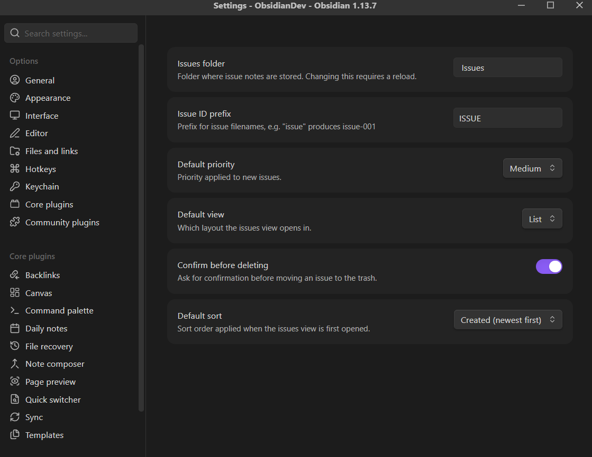
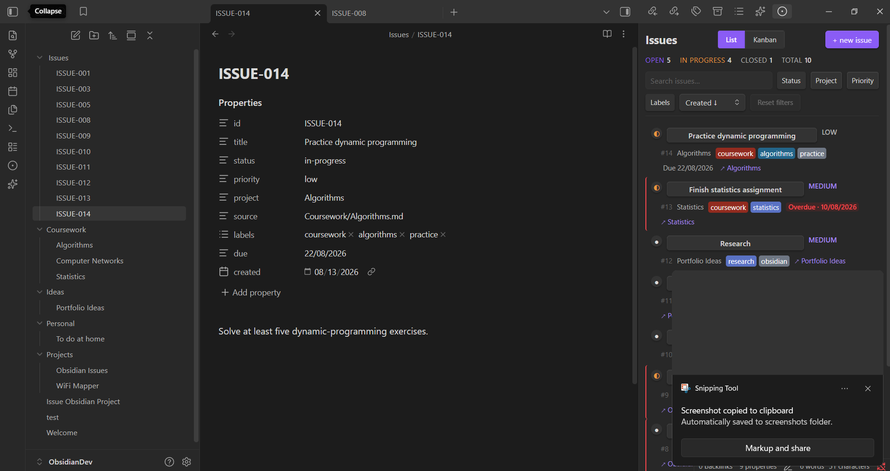
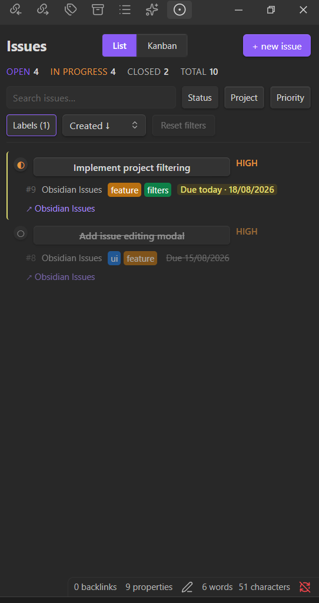
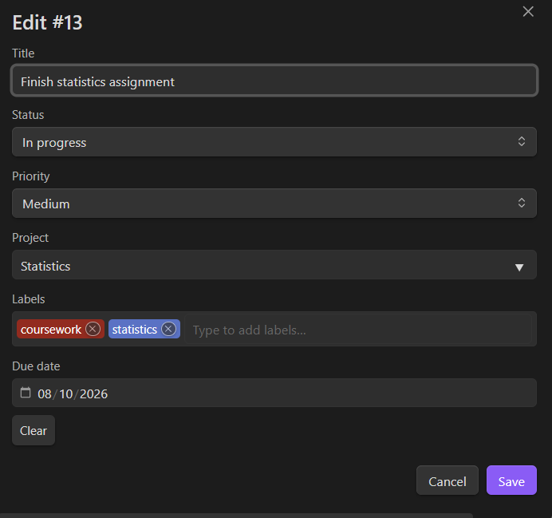
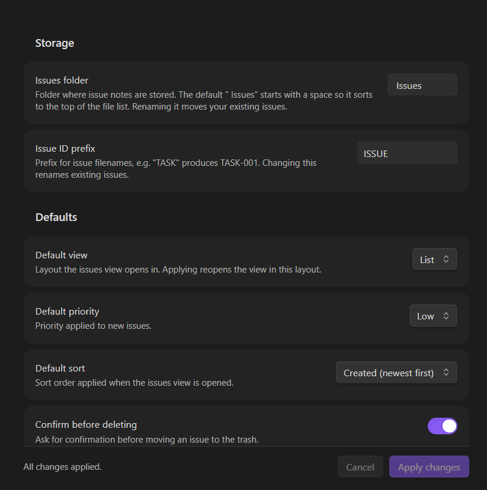

# Vault Issues

A GitHub Issues–inspired issue tracker for Obsidian. Issues are plain Markdown files with YAML frontmatter, so your backlog stays readable, greppable, and portable — with or without the plugin installed.

**Desktop only.** No account, no network access, no telemetry.

## Screenshots

| Issues sidebar (list) | Issues sidebar (Kanban) |
|:---:|:---:|
|  |  |

| New/edit issue form | Settings tab |
|:---:|:---:|
|  |  |

| Full view | Filtering |
|:---:|:---:|
|  |  |

| Editing tab | Settings tab (detail) |
|:---:|:---:|
|  |  |

> These screenshots reflect the current 1.0 release. A short demo GIF has not been recorded yet.

## Features

- **Issues as Markdown** — One file per issue, all metadata in frontmatter.
- **List and Kanban layouts** — Switch from the header, a command, or settings.
- **Drag-and-drop Kanban** — Moving a card rewrites the issue's `status` immediately.
- **Three statuses** — Open, In progress, Closed. Click the status dot to cycle.
- **Priorities** — Low, Medium, High, Critical, with colour-coded badges.
- **Labels** — Colour-coded pills with autocomplete over labels already in use.
- **Projects** — Group issues by a free-text project name, with autocomplete.
- **Due dates** — Native date picker, colour-coded by urgency (red = overdue, amber = due today, muted = future; a closed issue is never shown as overdue).
- **Search, filtering and sorting** — Across titles, bodies, labels, projects and IDs.
- **Two-way note linking** — An issue records its source note, and the note records the issue.
- **Right-click context menus** — Open, edit, change status, jump to the source note, delete.
- **Keyboard accessible** — Filters, status toggles and Kanban cards are all reachable without a mouse.
- **Configurable storage** — Choose the issues folder and the ID prefix; both changes migrate existing issues rather than orphaning them.
- **Theme-aware** — Colours come from Obsidian's theme variables.

## Installation

Vault Issues is not yet in the Obsidian Community Plugins directory. Until it is, install it manually:

1. Download `main.js`, `manifest.json` and `styles.css` from the [latest release](https://github.com/albertaizic/obsidian-issues/releases).
2. Create a folder in your vault at `.obsidian/plugins/vault-issues/`.
3. Put the three files in it.
4. In Obsidian, go to **Settings → Community plugins**, turn off Restricted mode if it is on, then select the reload icon next to **Installed plugins**.
5. Enable **Vault Issues**.

## Quick start

1. Open the Command Palette and run **Vault Issues: Open issues**, or select the circle-dot icon in the ribbon. The issues view opens in the right sidebar.
2. Select **+ new issue**.
3. Give it a title and select **Create**.

You now have a folder in your vault:

```text
YourVault/
├──  Issues/
│   └── ISSUE-001.md
└── .obsidian/
```

The default folder is `" Issues"` — with a leading space, so it sorts to the top of the file list. Both the folder and the `ISSUE` prefix are configurable.

## Creating issues

There are three ways to create an issue:

| How | What it does |
| --- | --- |
| **+ new issue** in the view header | Opens an empty form |
| **Create issue** command | The same form, from anywhere in Obsidian |
| **Create issue for current note** command | Pre-fills the title, project and source from the active note, and links the two together |

The form has a title (required), priority, project, labels and a due date. Status is only editable when editing an existing issue — new issues always start as open.

> **Note:** The "Create issue for current note" command is disabled when the active file is already an issue file (i.e., when you are viewing an existing issue). This prevents accidentally creating a circular reference.

## Issue format

Each issue is a Markdown file named `<PREFIX>-<NNN>.md`. Everything the plugin knows lives in the frontmatter; the body is yours.

```md
---
id: ISSUE-007
title: Rewrite the onboarding section
status: in-progress
priority: high
project: Handbook
source: Notes/Handbook.md
labels:
  - docs
  - onboarding
due: 20/08/2026
created: 2026-08-13
---

Describe the issue here.
```

| Field | Values |
| --- | --- |
| `id` | `<PREFIX>-<NNN>`, matching the filename |
| `title` | Free text; falls back to the filename if missing |
| `status` | `open`, `in-progress`, `closed` — anything else reads as `open` |
| `priority` | `low`, `medium`, `high`, `critical` — anything else reads as `medium` |
| `project` | Free text, optional |
| `source` | Vault path of the linked note, optional |
| `labels` | A YAML list, optional |
| `due` | `DD/MM/YYYY`, optional |
| `created` | `YYYY-MM-DD` |

Files are written through Obsidian's own frontmatter API, so quotes, colons and other YAML-hostile characters in a title are escaped correctly, and the body is never rewritten. Hand-editing an issue in the editor is safe; missing or unrecognised fields fall back to defaults rather than breaking the view.

## List view

Each row shows the status dot, the issue ID and title, and its metadata: priority badge, labels, project, due date and a link to the source note.

- Select the row to open the issue note.
- Select the status dot to cycle open → in progress → closed.
- Hover for edit and delete buttons.
- Right-click for the full context menu.

The header shows live open and closed counts, plus a `Showing 6 of 37` line whenever a search or filter is narrowing the list.

## Kanban

The Kanban layout renders **Open**, **In progress** and **Closed** columns.

- Drag a card between columns to change its status — the frontmatter is rewritten immediately.
- Cards are focusable: `Tab` to one and press `Ctrl`/`Cmd` + `←`/`→` to move it between columns without a mouse.
- Empty columns still render, so a fresh vault shows the board structure and every column stays a valid drop target.

The status filter is hidden in this layout — the columns already are the status axis.

## Search, filtering and sorting

The toolbar carries a debounced search box, filter dropdowns and a sort dropdown.

- **Search** matches titles, bodies, labels, projects and issue IDs.
- **Filters** — status, project, priority and labels. Each is multi-select and shows a count when active, with a **Clear <filter>** action in its panel.
- **Sort** — Created ↓/↑, Due soonest/latest, Priority ↓/↑. Issues with no due date always sort last, in both directions.
- **Reset filters** clears everything at once, and only becomes prominent once something is actually active.

Filters are view state, not saved settings; the *default* sort order is a setting.

## Linking issues to notes

Running **Create issue for current note** on an open note creates a two-way link:

- the issue gets `source: Notes/Handbook.md`
- the note gets the issue's ID in its own `issues` frontmatter list

```md
---
issues:
  - ISSUE-007
---
```

From an issue you can jump to its source note via the context menu. The links are maintained automatically: renaming a note updates the `source` of every issue pointing at it, deleting a note clears the dangling reference, and deleting an issue removes its entry from the note.

## Commands

| Command | What it does |
| --- | --- |
| **Open issues** | Reveals the issues view in the right sidebar |
| **Create issue** | Opens the new-issue form |
| **Create issue for current note** | Creates an issue linked to the active note (disabled when viewing an issue) |
| **Toggle list / kanban layout** | Switches the issues view between layouts |

Obsidian prefixes these with the plugin name in the Command Palette. None of them ship a default hotkey — assign your own under **Settings → Hotkeys**.

## Settings

**Settings → Community plugins → Vault Issues**

| Setting | Default | Notes |
| --- | --- | --- |
| **Issues folder** | `" Issues"` | Where issue files live. Changing it moves your existing issues. |
| **Issue ID prefix** | `ISSUE` | Normalised to uppercase alphanumerics and underscores. Changing it renames existing issues and updates linked notes. |
| **Default view** | List | Layout the view opens in |
| **Default priority** | Medium | Pre-filled on new issues |
| **Default sort** | Created ↓ | Sort order the view opens with |
| **Confirm before deleting** | On | Ask before moving an issue to the trash |

Settings are staged, not written as you type: edit the fields, then select **Apply changes** — or **Cancel** to discard. This matters because two of them move files on disk. Apply reports what it did, and keeps the old folder if it still contains anything that isn't an issue.

A folder name starting with `.` is rejected rather than silently corrected: Obsidian's vault API skips dot-prefixed paths entirely, so issues stored there would be invisible to the plugin.

## Data and portability

- Everything is a Markdown file in your vault. There is no database and no separate index.
- Deleting an issue uses Obsidian's trash setting rather than an unrecoverable delete.
- The plugin makes **no network requests** and collects **no telemetry**. It has no runtime dependencies.
- It reads and writes only the configured issues folder, plus the `issues` frontmatter key of notes you explicitly link.
- Uninstalling leaves your issues behind as ordinary notes.

Issues created by earlier versions are migrated automatically on load: the legacy `.Issues` and `Issues` folders, and the v0.5 default `" Issues"`, are moved into the configured folder. Anything already present at the destination is left alone.

## Development

Work in a **separate development vault**, not your real one. Clone the repository into the vault's plugin folder — the folder name must match the plugin ID, `vault-issues`:

```text
ObsidianDev/
└── .obsidian/
    └── plugins/
        └── vault-issues/
```

```bash
git clone https://github.com/albertaizic/obsidian-issues.git vault-issues
cd vault-issues
npm ci
npm run dev
```

Then open the vault, enable **Vault Issues** under **Settings → Community plugins**, and run **Open issues**.

**Obsidian only ever runs `main.js`** — editing `src/` is not enough. `npm run dev` rebuilds on save, but you still need to reload the plugin (disable and re-enable it, or run **Reload app without saving**) for Obsidian to pick up the new file.

A production build is minified:

```bash
npm run build
```

If esbuild refuses to run — most often because `node_modules` was installed on a different OS than the one you are building on — there is a `tsc`-based fallback that produces a larger, unminified bundle with identical behaviour:

```bash
npm run build:fallback
```

`npm run build` remains the supported path, and is what releases are built with.

## Testing

```bash
npm run lint
npm test
```

Tests use Node's built-in test runner (Node 20+) against the TypeScript sources via `jiti`. The suite is 174 tests covering settings normalisation, issue ID and filename handling, filtering, sorting, status and date coercion, frontmatter parsing, folder/prefix migration planning, and the label palette. CI runs lint, build and tests on Node 20, 22 and 24.

## Architecture

`src/` is bundled by esbuild into `main.js` at the repository root. Obsidian loads `main.js`, `manifest.json` and `styles.css`.

```text
src/
  main.ts             Plugin lifecycle, commands, vault event wiring
  issue-service.ts    Reads, writes, caches and migrates issue files
  issue-modal.ts      New/edit issue form
  tag-input.ts        Label tag-input with autocomplete
  labels.ts           Label name → palette slot
  dates.ts            Date parsing, formatting and comparison
  constants.ts        Status/priority enums, field order, defaults
  types.ts            Issue, IssueData, IssueStatus, IssuePriority
  settings.ts         Settings tab UI
  confirm-modal.ts    Reusable confirmation dialog
  components/
    issues-toolbar.ts   Search, filter dropdowns, sort, reset
    issue-actions.ts    Edit/delete buttons, context menu, status changes
    issue-meta.ts       Priority, labels, due date, source rendering
  config/
    settings.ts         Settings interface, defaults, validation, normalisation
  filters/
    issue-filter.ts     Search and multi-select filtering
    issue-sort.ts       Sorting by created, due or priority
  utils/
    issue-id.ts         Prefix normalisation, filename matching, next ID
    migration.ts        Pure folder-move and prefix-rename planning
  views/
    issues-view.ts      View coordinator: state, refresh, layout
    issues-list.ts      List rendering
    issues-kanban.ts    Kanban rendering and drag-and-drop
```

Two conventions worth knowing before you change things:

- **Pure logic is separated from Obsidian-dependent code** so it can be tested without a running app. Filtering, sorting, ID handling, settings normalisation and migration planning are all pure.
- **No styles are assigned from JavaScript.** Anything visual belongs in `styles.css`; the code only chooses class names. This is enforced by a test and required for community-plugin review.

CSS class names are namespaced `obsidian-issues-*`. That prefix predates the rename to Vault Issues and is deliberately kept — renaming hundreds of selectors carries risk for no user-visible benefit.

## Contributing

Bug reports, feature requests and pull requests are welcome. See [CONTRIBUTING.md](CONTRIBUTING.md) for the development setup and what a good report looks like, and [CHANGELOG.md](CHANGELOG.md) for release history.

## License

[0BSD](LICENSE)