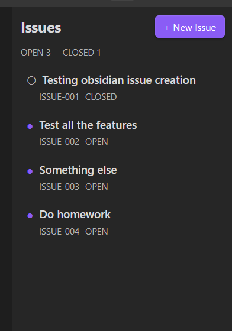
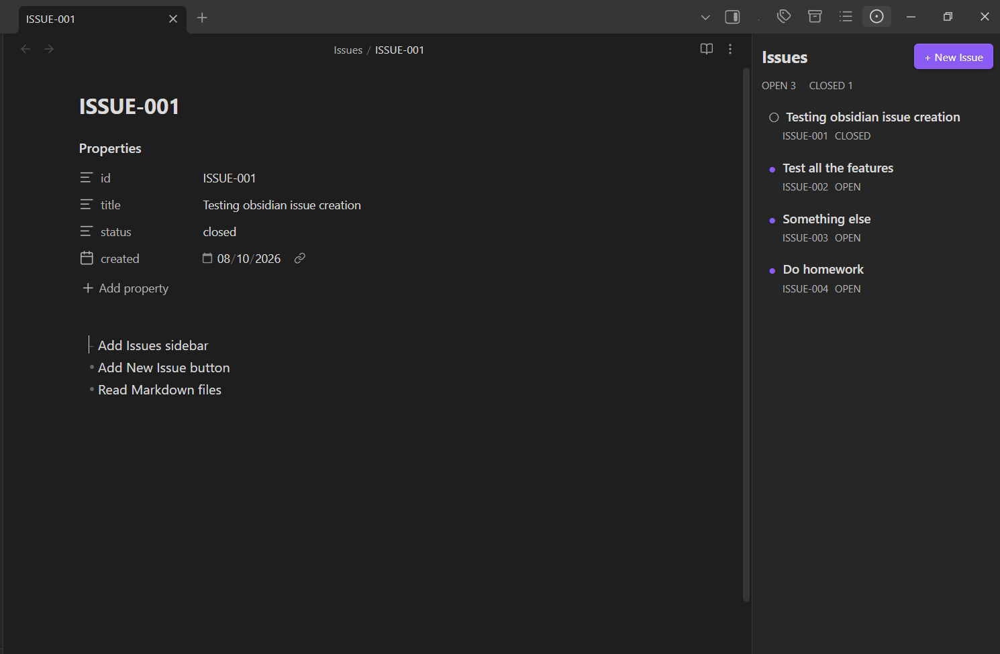
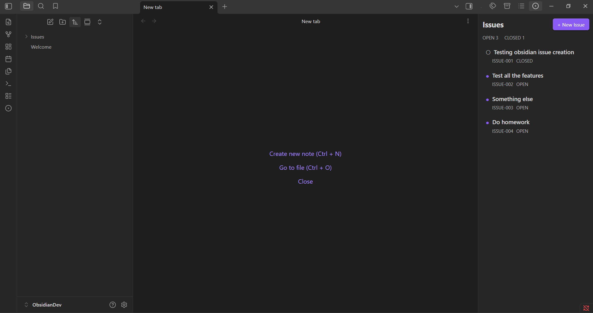
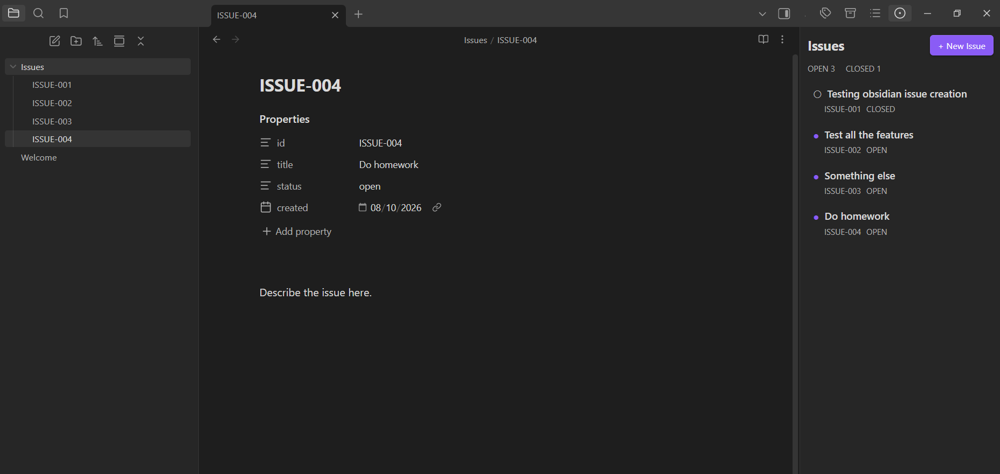

# Obsidian Issues

A GitHub Issues-inspired issue tracker for Obsidian. Issues are stored as normal Markdown files, so your data remains readable and useful even without the plugin.

## Milestone: v0.1 starter

This first milestone supports:

- `Open issues` command
- right-sidebar Issues view
- `+ New Issue` button
- automatic `Issues/` folder creation
- sequential files such as `ISSUE-001.md`, `ISSUE-002.md`, ...
- reading issue `title` and `status` from YAML frontmatter
- opening an issue note by clicking it in the sidebar
- live sidebar refresh when issue files change

Example issue:

```md
---
id: ISSUE-001
title: New issue
status: open
created: 2026-08-10
---

Describe the issue here.
```

## Development setup

Use a separate development vault. A convenient layout is:

```text
ObsidianDev/
└── .obsidian/
    └── plugins/
        └── obsidian-issues/
```

Clone this repository into the plugin folder, then run:

```bash
npm install
npm run dev
```

In Obsidian:

1. Open the `ObsidianDev` vault.
2. Go to **Settings → Community plugins**.
3. Turn off Restricted mode if necessary.
4. Enable **Obsidian Issues**.
5. Open the Command Palette and run **Open issues**.
6. Click **+ New Issue**.

You should now have:

```text
ObsidianDev/
├── Issues/
│   └── ISSUE-001.md
└── .obsidian/
    └── plugins/
        └── obsidian-issues/
```

## Production build

```bash
npm run build
```

The build produces `main.js` in the repository root. Obsidian loads the plugin from `main.js`, `manifest.json`, and `styles.css`.

## Screenshots






## Roadmap

- **v0.1** — create/read/close issues
- **v0.2** — labels, priority, projects
- **v0.3** — filters, search, due dates
- **v0.4** — Kanban/dashboard
- **v1.0** — polished release, tests, documentation, demo GIF, GitHub release
